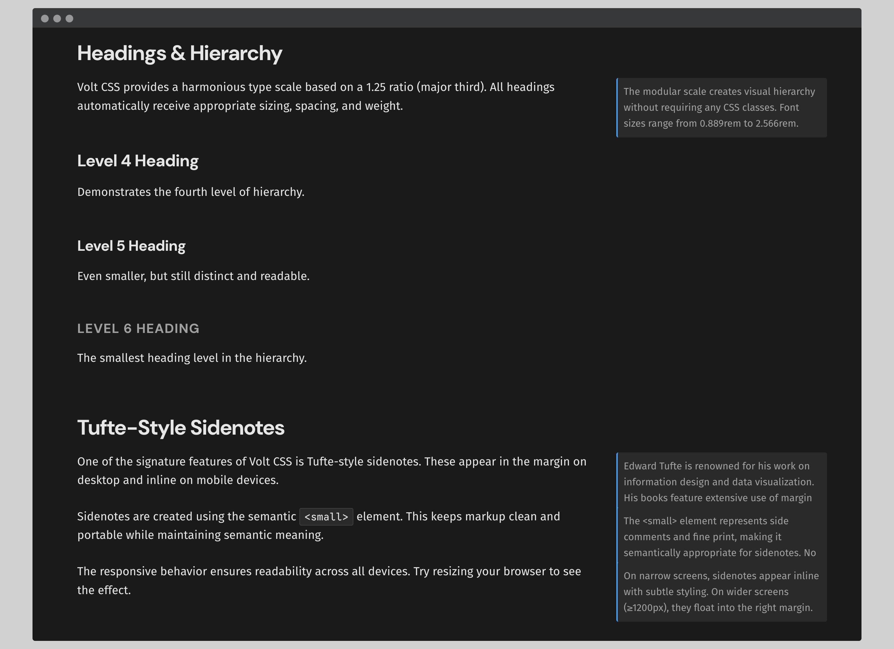
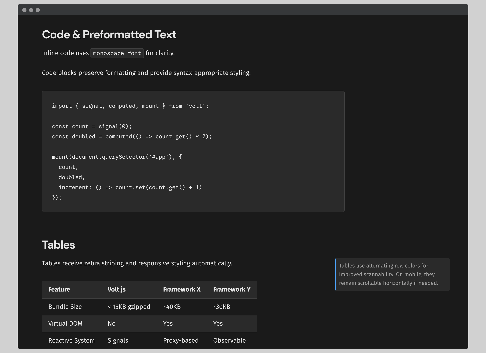
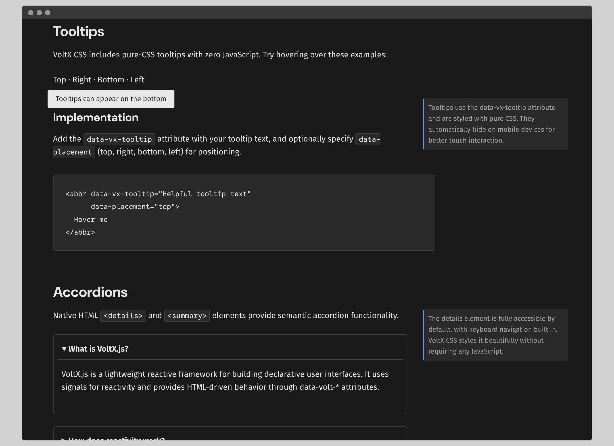

# VoltX.js

[](https://codecov.io/gh/stormlightlabs/volt)
[](LICENSE)
[](https://jsr.io/@voltx/core)


> ⚠️ **Pre-release Software**: VoltX.js remains in active development. Expect breaking changes until v1.0 and evaluate before using in production.

Volt is a monorepo centered around the VoltX.js runtime—a lightweight, declarative alternative to component-centric UI frameworks. The repo also ships the Volt CLI and the documentation site that demonstrates and explains the runtime.

## Philosophy/Goals

- Behavior is declared via `data-volt-*` attributes.
    - HTML drives the UI, not components.
- Core under **20 KB gzipped**, zero dependencies.
- Signals update the DOM directly without a virtual DOM.
    - Native Server-Sent Events (SSE) and WebSocket patch updates.
    - No reactivity scheduler, no VDOM diffing.
- Extend behavior declaratively (persist, scroll, animate, etc.).
- Progressive enhancement, i.e. works with static HTML out of the box.

### Values

- Never exceed 15 KB for the core runtime.
- No custom build systems — work with any backend.
- All source in TypeScript, no magical DSLs.
- Every feature ships with a test harness.

## Concepts

| Concept  | Description                                                                                       |
| -------- | ------------------------------------------------------------------------------------------------- |
| Signals  | Reactive primitives that automatically update DOM bindings when changed.                          |
| Bindings | `data-volt-text`, `data-volt-html`, `data-volt-class` connect attributes or text to expressions.  |
| Actions  | `data-volt-on-click`, `data-volt-on-input`, etc. attach event handlers declaratively.             |
| Streams  | `data-volt-stream="/events"` listens for SSE or WebSocket updates and applies JSON patches.       |
| Plugins  | Modular extensions (`data-volt-persist`, `data-volt-surge`, `data-volt-shift`, etc.) to enhance the core. |

## VoltX.css

VoltX ships with an optional classless CSS framework inspired by Pico CSS and Tufte CSS. It provides beautiful, semantic styling for HTML elements without requiring any CSS classes—just write semantic markup and it looks great out of the box.

Features include typography with modular scale, Tufte-style sidenotes, styled form elements, dialogs, accordions, tooltips, tables, and more. See the framework's [README](./lib/README.md#voltxcss) for installation and usage details.

Here are some highlights







## Packages

```sh
volt/
├── lib/   VoltX.js runtime published to npm (`voltx.js`) and JSR (`@voltx/core`)
├── dev/   Volt CLI and local tooling
└── docs/  VitePress documentation site
```

## Getting Started

- Runtime usage: see [`lib/README.md`](./lib/README.md) for installation guides and quick-start examples.
- Local development: `pnpm install` then `pnpm --filter lib dev` run package-specific scripts (`build`, `test`, etc.).
    - Review [contribution](./CONTRIBUTING.md) guidelines
- Documentation: `pnpm --filter docs docs:dev` launches the VitePress site.

### Working on New Features

The `lib/` package includes a comprehensive demo Vite app showcasing all VoltX.js features:

```sh
# Start the demo development server
pnpm --filter voltx.js dev
```

The demo app essentially provides an interactive sandbox to develop and catch bugs in new implementations.

#### Pages

- **Home**: Framework overview and quick start examples
- **CSS**: VoltX.css typography, layout, and component features
- **Interactivity**: Dialogs, buttons, event handling
- **Forms**: Two-way binding and form validation patterns
- **Reactivity**: Signals, computed values, conditional/list rendering
- **Plugins**: Persistence, scroll management, URL sync
- **Animations**: Transitions and keyframe animations

Docs are the source of truth but take advantage of this environment. When developing new features, add examples to the appropriate demo section or create a new page to showcase the functionality.

## License

MIT License © 2025 Stormlight Labs
